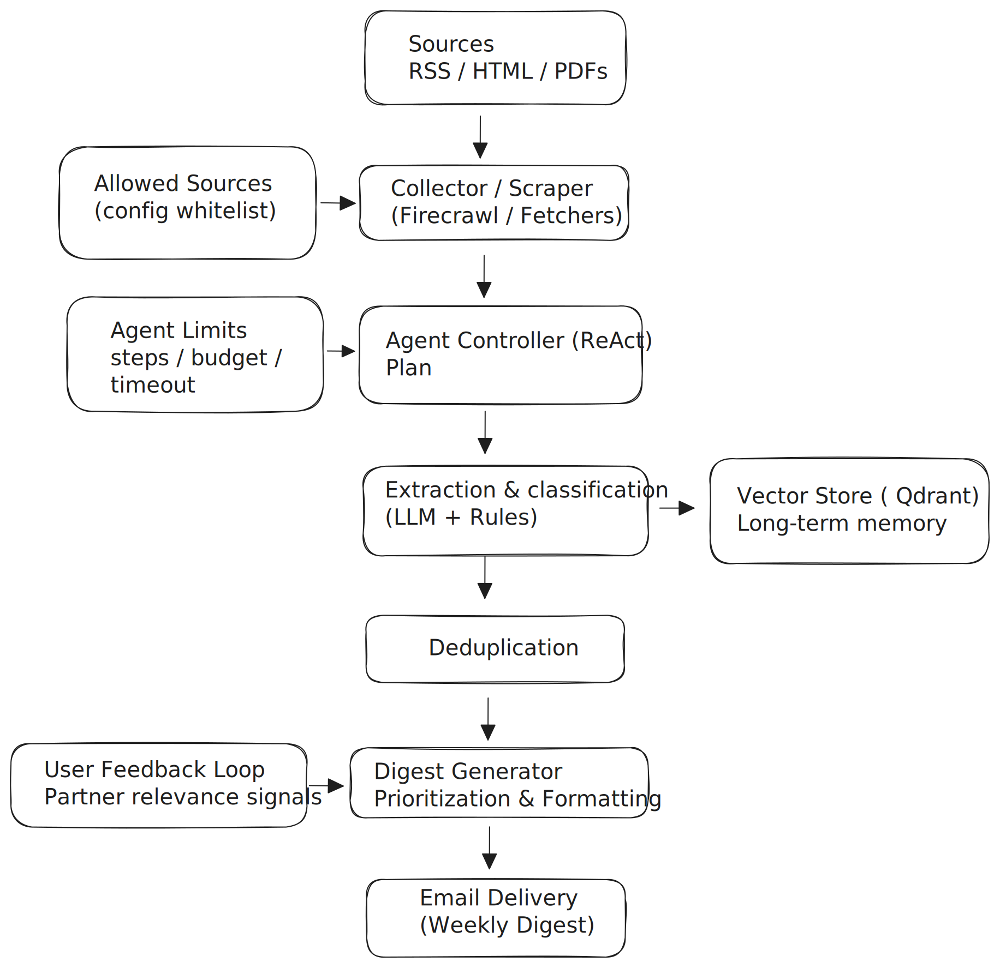

# AI Trend Monitoring

> Demo repository showcasing the architecture and outputs of an AI-assisted, rule-based trend monitoring agent for financial services.

---

## Demo

- Loom walkthrough (3–4 min): <PASTE_LOOM_LINK_HERE>
- Example output: `examples/sample-digest-v1.md`
- Agent execution trace (v2): examples/v2-agent-execution-trace.md

## Architecture

The diagram illustrates the end-to-end flow from source ingestion to executive-ready email delivery,
including agent orchestration, guardrails, and long-term memory.

---

## Overview

AI-assisted agent for monitoring financial and regulatory developments. 

Built for consulting partners, demonstrating end-to-end agentic pipeline with feedback loops, adaptive prioritization, and incremental evolution (v1→v3).

The agent collects signals from selected sources, applies configurable rules and prioritization logic, uses LLMs for structured extraction and interpretation, and produces concise, executive-ready digests.

This repository is intentionally scoped as a **portfolio-grade demonstration** of agent design, system architecture, and reasoning — not as a production system.

---

## Capabilities

Scalable architecture: Environment-driven model configuration enables controlled model upgrades and clear cost transparency.

- Source-based signal collection
- Rule-based filtering and prioritization
- LLM-assisted extraction and summarization
- Impact classification (e.g. high / medium)
- Generation of executive-ready Markdown digests

---

## How It Works (High Level)
collect → dedupe → apply_rules → extract → digest → output
1. **Collect** signals from predefined sources  
2. **Dedupe** overlapping or repeated items  
3. **Apply rules** to filter and prioritize signals  
4. **Extract** structured insights using LLMs  
5. **Digest** content into a concise executive format  
6. **Output** as Markdown (email-ready)

---
## Typical Use Case

Used by management consulting partners and advisory teams within financial services to:

- Monitor regulatory and market developments
- Identify high-impact signals early
- Produce structured, client-ready briefings for executives

---

## Scope
This system is designed for financial services monitoring with configurable sources.
Demo uses public fintech/regulatory sources for illustration.

---

## Repository Structure

- `examples/`: Sample outputs generated by the agent (e.g. executive trend digests).
- `docs/`: High-level documentation describing architecture, design decisions, and pipeline flow.
- `templates/`: Reusable templates for digests and configuration examples.
- `src/`: Pipeline implementation (collect, extract, dedupe, digest)

